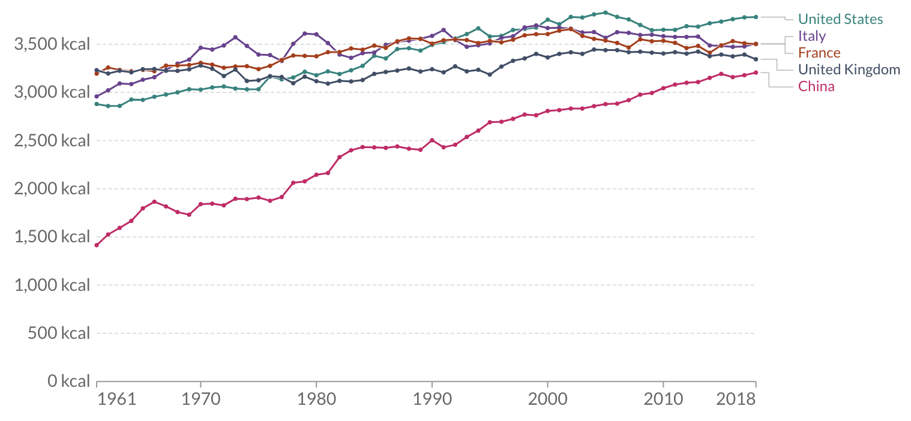

exclude: true

# The Big Picture

- Predict the location of non stationary in time series
  - Given a window a window of interest within a series:
    How likely will the window contain a non stationary component?

- What is non stationary?
  - Data Generating
  - Strong Stationary
  - $F_{X}(x_{t_{1+\mathcal{T}}}, ..., x_{t_{n+\mathcal{T}}}) = F_{X}(x_{t_{1}}, ..., x_{t_{n}})$ 
  - $F_{X}$ -> Probability -> From an integral

- Why is it interesting?
  - How random is any stream of data?

- We are trying to predict changes in random variable relationship from their aggregate
    - Panel vs Plain Time Series

---

# Data

- Food Supply Time series set from 'Our World in Data'

```{r, echo = FALSE}

```

- Follows a relatively stable trend with some large deviations

---

# Methods

- We are Predicting probability - Numerical Outcome - Regression

- Using linear regression, elasticnet, boosted trees, logistic regression
  - Outcome -> The probability some interval is non stationary
  - Predictors -> Interval Size, Series Size, Start, Calorie per capita

- Tuning
  - Hyper parameters 
    - Lambda, Alpha -> Elastic net
    - Learning Rate (Different Lambda) - Number of Trees - Tree Depth

- Training on many series 
  - Testing on a new series 
  - Five fold cross validation (Its the best)
  
---

# Results and conclusion

Measurement of success: RMSE for distance of prediction to actual shock
  - Probability -> an area over a distance

- Bias - Location of Prediction too soon or too late
  - not enough interval sizes
  - shocks of series occur close together, overestimate PDF of first shock
  
- Variance - Changing the distribution of prediction
  - Range to large for location of actual outcome
      
- Performance Limitations/Barriers: Colinearity issues


